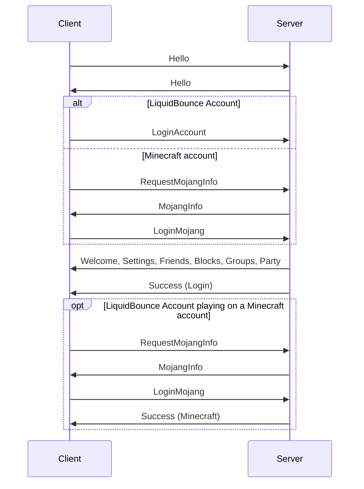

# The AxoChat protocol
The AxoChat protocol is based on websockets.
All packets are sent to the `/ws` endpoint.

There are two versions. [v1](#protocol-v1) is the original protocol, which
every client speaks. [v2](#protocol-v2) extends it with LiquidBounce Account
login, roles, channels, friends, groups, parties and moderation.

# Packets
Packets are sent in websocket `text` messages encoded as JSON objects.
They all have a structure like that, with `c` being optional:
```json
{
    "m": "Name",
    "c": {
        "...": "...",
        "...": false
    }
}
```

Not every packet has a body:
```json
{
    "m": "Name"
}
```

# Protocol v1

## Client
Client Packets are received by the client.

### Error
This packet may be sent at any time,
but is usually a response to a failed action of the client.
`message` is always the name of the error.

**Example**
```json
{
    "m": "Error",
    "c": {
        "message": "LoginFailed"
    }
}
```

### Message
This packet will be sent to every logged in client,
if another client successfully [sent a message](#message-1) to the server.

- `author_info` is just the name and uuid of the user that sent the message.
  For a LiquidBounce Account, `uuid` is its linked Minecraft account, or the
  nil UUID.
- `content` is any message fitting the validation scheme of the server.

**Example**
```json
{
    "m": "Message",
    "c": {
        "author_info": {
            "name": "Notch",
            "uuid": "069a79f4-44e9-4726-a5be-fca90e38aaf5"
        },
        "content": "Hello, World!"
    }
}
```

### MojangInfo
After the client sent the server a [RequestMojangInfo](#requestmojanginfo)
packet, the server will provide the client with a `session_hash`.
A session hash is synonymous with a *server id* in the context of
[authentication with mojang](https://wiki.vg/Protocol_Encryption#Authentication).
The client has to send a [LoginMojang](#loginmojang) packet to the server
after authenticating itself with mojang.

**Example**
```json
{
    "m": "MojangInfo",
    "c": {
        "session_hash": "88e16a1019277b15d58faf0541e11910eb756f6"
    }
}
```

### PrivateMessage
The content of this packet will be sent to a logged in client with `allow_messages` turned on,
if another client successfully [sent a private message](#privatemessage-1).

- `author_info` is just the name and uuid of the user that sent the message.
- `content` is any message fitting the validation scheme of the server.

**Example**
```json
{
    "m": "PrivateMessage",
    "c": {
        "author_info": {
            "name": "Notch",
            "uuid": "069a79f4-44e9-4726-a5be-fca90e38aaf5"
        },
        "content": "Hello, User!"
    }
}
```

### Success
This packet is sent after either
[LoginMojang](#loginmojang), [BanUser](#banuser) or [UnbanUser](#unbanuser)
were processed successfully.

- `reason` is the reason for the success; it is one of the following possible
  values:
  - `Login`
  - `Ban`
  - `Unban`

**Example**
```json
{
    "m": "Success",
    "c": {
        "reason": "Login"
    }
}
```

### UserCount
This packet is sent after [RequestUserCount](#requestusercount) was received.

- `connections` is the amount of connections this server has open
- `logged_in` is the amount of users logged in

**Example**
```json
{
    "m": "UserCount",
    "c": {
        "connections": 623,
        "logged_in": 531
    }
}
```

## Server
Server Packets are received by the server.

### BanUser
Staff can send this packet to mute users.

- `user` is the Minecraft uuid of the user to mute. It mutes that Minecraft
  account and any LiquidBounce Account it is linked to.

**Example**
```json
{
    "m": "BanUser",
    "c": {
        "user": "069a79f4-44e9-4726-a5be-fca90e38aaf5"
    }
}
```

### LoginJWT
No longer supported and answered with the error `NotSupported`; log in with
[LoginAccount](#loginaccount) instead.

### LoginMojang
After the client received a [MojangInfo](#mojanginfo) packet
and authenticating itself with mojang,
it has to send a `LoginMojang` packet to the server.
After the server receives a `LoginMojang` packet,
it will send [Success](#success) if the login was successful,
or the error `Banned` if the user or its address is banned.

- `name` needs to be associated with the uuid.
- `uuid` is not guaranteed to be hyphenated.
- If `allow_messages` is true, other clients may send private messages
  to this client.

**Example**
```json
{
    "m": "LoginMojang",
    "c": {
        "name": "Notch",
        "uuid": "069a79f4-44e9-4726-a5be-fca90e38aaf5",
        "allow_messages": true
   }
}
```

### Message
The `content` of this packet will be sent to every client
as [Message](#message) if it fits the validation scheme.

**Example**
```json
{
    "m": "Message",
    "c": {
        "content": "Hello, World!"
    }
}
```

### PrivateMessage
The `content` of this packet will be sent to the specified client
as [PrivateMessage](#privatemessage) if it fits the validation scheme.

- `receiver` is the name of the receiver.

**Example**
```json
{
    "m": "PrivateMessage",
    "c": {
        "content": "Hello, Notch!",
        "receiver": "Notch"
    }
}
```

### RequestJWT
No longer supported and answered with the error `NotSupported`.

### RequestMojangInfo
To login via mojang, the client has to send a `RequestMojangInfo` packet.
The server will then send a [MojangInfo](#mojanginfo) to the client.

This packet has no body.

**Example**
```json
{
    "m": "RequestMojangInfo"
}
```

### RequestUserCount
Staff can send this packet to receive a [UserCount](#usercount).

This packet has no body.

**Example**
```json
{
    "m": "RequestUserCount"
}
```

### UnbanUser
Staff can send this packet to lift the mutes of a Minecraft uuid.

- `user` is the uuid of the user to unmute.

**Example**
```json
{
    "m": "UnbanUser",
    "c": {
        "user": "069a79f4-44e9-4726-a5be-fca90e38aaf5"
    }
}
```

# Protocol v2

A client speaks v2 by sending [Hello](#hello-1) before it logs in. Sessions
without it stay on v1 and never receive a v2 packet or field. Everything from
v1 keeps working on v2, but a v2 client receives [ChatMessage](#chatmessage)
instead of `Message` and `PrivateMessage`.

v2 clients ignore packets and fields they do not know. Optional fields are
sent as `null`, except in [PartyMemberState](#partymemberstate) and the
`detail` of [Error](#error), which are left out when absent.



The server pings every 30 seconds and closes a v2 connection that has not
answered for 90 seconds.

One address may keep 16 connections that are not logged in; more are closed.
Logins from one address get a burst of 10, then one every two seconds; later
ones wait their turn for up to a minute, beyond that the answer is
`RateLimited`. Proving a Minecraft session counts as a login.

## Identities
A user is either a LiquidBounce Account (`account`) or a Minecraft account
verified through the session server (`mojang`). A Minecraft login whose UUID is
linked to a LiquidBounce Account logs in as that account.

Direct messages, friends, parties and groups are between LiquidBounce Accounts
on both sides; a Minecraft account gets `AccountRequired`. Everyone chats in
`global`, blocks and reports.

After logging in, an account session can prove the Minecraft account it plays
on with `RequestMojangInfo` and `LoginMojang`, answered by `Success`
(`Minecraft`). Others then see that account as `minecraft`.

Every user has a public `id`. Wherever a packet takes a `user`, it accepts an
`id` or a name. Names are not unique: they resolve to the requester's friends
and party first, then online users, then everyone else, the user seen first
winning; where only accounts count, only account names do. Account names drop
formatting codes and invisible or direction-changing characters, turn
whitespace into `_` and are at most 32 characters long. The server answers the same whether
an account exists or not: invites and friend requests to unknown names vanish,
direct messages to them are not accepted and reports succeed.

### UserRef
- `uuid` is the Minecraft UUID used for the head, the nil UUID if unknown.
- `minecraft` is the Minecraft account an online account proved it plays on.

```json
{
    "id": "0192f0e4-6b1e-7c4d-9a51-2f8f3c1d7a10",
    "kind": "account",
    "name": "1zun4",
    "uuid": "069a79f4-44e9-4726-a5be-fca90e38aaf5",
    "minecraft": { "uuid": "069a79f4-44e9-4726-a5be-fca90e38aaf5", "name": "Izuna" }
}
```

### Author
A [UserRef](#userref) with the user's roles, staff roles first.
`highlight` is set for donators and staff.

```json
{
    "id": "0192f0e4-6b1e-7c4d-9a51-2f8f3c1d7a10",
    "kind": "account",
    "name": "1zun4",
    "uuid": "069a79f4-44e9-4726-a5be-fca90e38aaf5",
    "minecraft": { "uuid": "069a79f4-44e9-4726-a5be-fca90e38aaf5", "name": "Izuna" },
    "roles": [{ "id": "premium", "name": "Premium", "staff": false }],
    "highlight": true
}
```

### Channels
| Channel | Recipients |
|---|---|
| `global` | everyone logged in |
| `server` | users on the same Minecraft server with `server_chat` on; the sender too |
| `party` | the sender's party |
| `group/<group id>` | members of the group |
| `user/<user>` | a direct message; received as `user/<sender id>`, echoed to the sender as `user/<receiver id>` |

Donators and staff may use `§` color and format codes (except `§k`) and emoji.

### Errors
v2 adds a `detail` to [Error](#error) where it helps, and these codes:
`UnknownUser`, `UnknownChannel`, `UnknownGroup`, `Muted`, `NotInParty`,
`AlreadyInParty`, `PartyFull`, `PartyLocked`, `NoInvite`, `NotFriends`,
`AlreadyFriends`, `AccountRequired`, `GroupFull`, `InvalidName`, `TooLarge`,
and `InvalidPacket` for packets the server cannot decode.

```json
{
    "m": "Error",
    "c": {
        "message": "InvalidCharacter",
        "detail": "€"
    }
}
```

## Client

### Hello
Answers [Hello](#hello-1).

```json
{ "m": "Hello", "c": { "protocol": 2 } }
```

### Welcome
Sent before `Success` on login.

```json
{
    "m": "Welcome",
    "c": {
        "user": { "id": "...", "kind": "mojang", "name": "Notch", "uuid": "...", "roles": [], "highlight": false },
        "staff": false
    }
}
```

### Settings
Sent on login and after [Settings](#settings-1).

```json
{
    "m": "Settings",
    "c": {
        "allow_messages": true,
        "hide_server": false,
        "accept_friend_requests": true,
        "server_chat": false
    }
}
```

### ChatMessage
- `id` identifies the message for [Report](#report).
- `time` is in milliseconds since the Unix epoch.

```json
{
    "m": "ChatMessage",
    "c": {
        "channel": "party",
        "id": 4182,
        "time": 1791446400000,
        "author": { "id": "...", "kind": "account", "name": "Izuna", "uuid": "...", "roles": [], "highlight": false },
        "content": "Hello, party!"
    }
}
```

### Friends
The full friend list, sent on login and on every change.
`server` is the address the friend plays on, unless hidden.

```json
{
    "m": "Friends",
    "c": {
        "friends": [
            { "user": { "id": "...", "kind": "account", "name": "Notch", "uuid": "...", "minecraft": null }, "since": 1791446400000, "online": true, "server": "hypixel.net" }
        ],
        "incoming": [{ "id": "...", "kind": "account", "name": "jeb_", "uuid": "..." }],
        "outgoing": []
    }
}
```

### Presence
A friend came online, went offline or changed servers.

```json
{ "m": "Presence", "c": { "user": "0192f0e4-...", "online": true, "server": "hypixel.net" } }
```

### Blocks
The full block list, sent on login and on every change.

```json
{ "m": "Blocks", "c": { "users": [{ "id": "...", "kind": "mojang", "name": "Spammer", "uuid": "..." }] } }
```

### Groups
Every group the user is in or invited to, sent on login and on every change.
`role` is one of `owner`, `admin`, `member`, `invited`.

```json
{
    "m": "Groups",
    "c": {
        "groups": [
            {
                "id": "0192f0e5-...",
                "name": "Bedwars",
                "role": "owner",
                "members": [
                    { "user": { "id": "...", "kind": "account", "name": "Izuna", "uuid": "..." }, "role": "owner", "online": true }
                ]
            }
        ]
    }
}
```

### Party
The user's party as seen by them, or `null`. Sent on login and whenever the
party or a member's relation changes.

- `role` is `leader`, `admin` or `member`.
- `relation` says where the member is relative to the receiver:

| Relation | Meaning |
|---|---|
| `self` | the receiver |
| `nearby` | one sees the other's player entity |
| `world` | the same world |
| `instance` | the same save, another dimension |
| `server` | the same server, another world or unknown |
| `elsewhere` | another server, singleplayer or no location |
| `offline` | not connected or not in game |

- `player` is the member's in-game profile from [Location](#location).
- `server` is the member's server address.

```json
{
    "m": "Party",
    "c": {
        "party": {
            "id": "0192f0e6-...",
            "leader": "0192f0e4-...",
            "locked": false,
            "pvp": false,
            "members": [
                {
                    "user": { "id": "0192f0e4-...", "kind": "account", "name": "Izuna", "uuid": "..." },
                    "role": "leader",
                    "online": true,
                    "muted": false,
                    "relation": "world",
                    "player": { "uuid": "069a79f4-...", "name": "Izuna" },
                    "server": "hypixel.net"
                }
            ]
        }
    }
}
```

### PartyInvite
`expires` is in milliseconds since the Unix epoch. Inviting someone again while
an invite is pending sends nothing.

```json
{ "m": "PartyInvite", "c": { "party": "0192f0e6-...", "from": { "id": "...", "kind": "account", "name": "Izuna", "uuid": "..." }, "expires": 1791446460000 } }
```

### PartyWarp
The leader asks the party to join their server. Clients confirm first.
Members already on that server are skipped; a private address only goes to
members behind the same public address. The leader receives it too, as
confirmation. At most once per 10 seconds.

```json
{ "m": "PartyWarp", "c": { "from": { "id": "...", "kind": "account", "name": "Izuna", "uuid": "..." }, "server": "hypixel.net" } }
```

### PartyMemberState
Relayed [PartyState](#partystate) of another member. Each present part replaces
the previous one. `position` only reaches members in the `nearby`, `world` or
`instance` relation.

```json
{
    "m": "PartyMemberState",
    "c": {
        "member": "0192f0e4-...",
        "position": { "x": 12.5, "y": 64.0, "z": -3.25, "yaw": 90.0, "pitch": 0.0, "dimension": "minecraft:overworld" }
    }
}
```

### Punished
The receiver was muted or banned. `expires` is `null` for permanent ones.

```json
{ "m": "Punished", "c": { "kind": "mute", "reason": "Spam", "expires": 1791450000000 } }
```

### Punishments
Staff only, answers [RequestPunishments](#requestpunishments).

```json
{
    "m": "Punishments",
    "c": {
        "user": { "id": "...", "kind": "mojang", "name": "Spammer", "uuid": "..." },
        "punishments": [
            { "id": "0192f0e7-...", "kind": "mute", "ip": null, "reason": "Spam", "issued_by": null, "created": 1791446400000, "expires": 1791450000000 }
        ]
    }
}
```

### Reports
Staff only, answers [RequestReports](#requestreports) with the latest 50
unresolved reports. `ReportCreated` carries a single new `report`.

```json
{
    "m": "Reports",
    "c": {
        "reports": [
            {
                "id": "0192f0e8-...",
                "reporter": { "id": "...", "kind": "account", "name": "Izuna", "uuid": "..." },
                "target": { "id": "...", "kind": "mojang", "name": "Spammer", "uuid": "..." },
                "channel": "global",
                "message": 4182,
                "content": "buy cheap coins",
                "reason": "Spam",
                "time": 1791446400000
            }
        ]
    }
}
```

`Success` gains the reasons `Report`, `Punish`, `Pardon`, `Resolve` and `Minecraft`.

## Server

### Hello
Sent before logging in. Ignored afterwards.

```json
{ "m": "Hello", "c": { "protocol": 2 } }
```

### LoginAccount
Logs in with a LiquidBounce Account access token.

```json
{ "m": "LoginAccount", "c": { "token": "eyJhbGciOi...", "allow_messages": true } }
```

### Settings
Every field is optional.

- `hide_server` hides the server address from friends.
- `server_chat` joins the `server` channel. It shows the user to everyone
  else on that Minecraft server who uses it.

```json
{ "m": "Settings", "c": { "server_chat": true } }
```

### ChatMessage
```json
{ "m": "ChatMessage", "c": { "channel": "user/Notch", "content": "Hi!" } }
```

### Friend
`action` is `request`, `accept`, `decline` or `remove`.
A request that was withdrawn or declined is ignored for 10 minutes when sent
again.

```json
{ "m": "Friend", "c": { "action": "request", "user": "Notch" } }
```

### Block
```json
{ "m": "Block", "c": { "user": "Spammer", "blocked": true } }
```

### Group
Only friends can be invited. Owners and admins invite, kick and rename; only
the owner promotes and deletes.

| `action` | Fields |
|---|---|
| `create` | `name` |
| `rename` | `group`, `name` |
| `invite` | `group`, `user` |
| `accept` | `group` |
| `decline` | `group` |
| `leave` | `group` |
| `kick` | `group`, `user` |
| `promote` | `group`, `user`, `admin` |
| `delete` | `group` |

```json
{ "m": "Group", "c": { "action": "invite", "group": "0192f0e5-...", "user": "Notch" } }
```

### Party
A party has at most 8 members. Inviting without a party creates one. Leader
and admins invite and kick; the leader promotes, transfers, locks, mutes,
toggles PvP, warps and disbands. Invites expire after 60 seconds; members who
go offline stay for 5 minutes.
Accepting an invite while in another party leaves that party first; a failed
accept leaves you where you were. A locked party drops pending invites and
takes no new members.

| `action` | Fields |
|---|---|
| `invite` | `user` |
| `accept` | `party` |
| `decline` | `party` |
| `leave` | |
| `kick` | `user` |
| `promote` | `user`, `admin` |
| `transfer` | `user` |
| `lock` | `locked` |
| `mute` | `user`, `muted` |
| `pvp` | `enabled` |
| `warp` | |
| `disband` | |

```json
{ "m": "Party", "c": { "action": "pvp", "enabled": false } }
```

### Location
Where the client plays. Sent when joining a world, changing dimension, and
when the world age drifts more than 40 ticks from the client's prediction.
`null` fields mean unknown; `"server": null` means singleplayer or no world.

- `server` is the address as typed. LiquidProxy routes (`*.liquidproxy.net`,
  `*.liquidbounce.net`) work as their owner's subscription: clients must not
  send them, and the server drops them.
- `seed` is the hashed seed from the login and respawn packets, 0 if absent,
  as a number or a decimal string (for clients without 64-bit integers).
- `age` is the world's game time in ticks, `null` while it does not advance.
- `player` is the client's in-game profile on that server. After a proven Minecraft
  session, it must be that account or the offline-mode UUID of its name, or it
  is dropped.

```json
{
    "m": "Location",
    "c": {
        "server": "mc.hypixel.net",
        "world": { "dimension": "minecraft:overworld", "seed": -4172144997902289642, "age": 1823004 },
        "player": { "uuid": "069a79f4-44e9-4726-a5be-fca90e38aaf5", "name": "Izuna" }
    }
}
```

The server decides the [relation](#party) of two members, first match wins:

1. Either has no location: `offline`.
2. One sees the other's player entity: `nearby`.
3. The servers differ: `elsewhere`.
4. The world ages started within 5 seconds of each other:
   - same dimension, and equal non-zero seeds or one in the other's tab list:
     `world`;
   - another dimension, and equal or missing seeds: `instance`.
5. Otherwise: `server`.

### Sightings
Party members whose player the client sees as an entity or in the tab list.
They count until the next `Sightings` or a new world.

```json
{ "m": "Sightings", "c": { "entities": ["0192f0e4-..."], "tab": ["0192f0e4-...", "0192f0e9-..."] } }
```

### PartyState
Live state shared with the party, at most 16 KiB per packet. Limits per second:
10 `position`, 4 `status`, 1 `inventory`; excess is dropped, and so are positions
beyond 30,000,000 blocks.

`Item` is `{ "identifier", "displayName", "count", "damage", "maxDamage", "empty", "enchantments" }`
with `displayName` as a text component and `enchantments` mapping ids to levels.
Empty slots are `null`; fields at their default may be left out.

Members who join or come back get the last state of everyone else.

```json
{
    "m": "PartyState",
    "c": {
        "position": { "x": 12.5, "y": 64.0, "z": -3.25, "yaw": 90.0, "pitch": 0.0, "dimension": "minecraft:overworld" },
        "status": {
            "health": 14.0, "max_health": 20.0, "absorption": 4.0,
            "food": 18, "saturation": 3.5, "armor": 15, "xp_level": 30,
            "game_mode": "survival", "ping": 42, "dead": false,
            "effects": [{ "id": "minecraft:speed", "amplifier": 1, "duration": 600 }],
            "main_hand": { "identifier": "minecraft:diamond_sword", "count": 1 },
            "off_hand": null,
            "armor_items": []
        },
        "inventory": { "main": [], "armor": [], "offhand": null, "ender_chest": null }
    }
}
```

### Report
`message` is the [ChatMessage](#chatmessage) id, if any; it must be the
target's and readable by the reporter, or the answer is `InvalidId`.

A user files at most 10 reports per hour, beyond that the answer is
`RateLimited`; repeating a report changes nothing. Reports with a `message`
from five networks within an hour mute the target for an hour until staff
review. Users first seen less than a day ago do not count.

```json
{ "m": "Report", "c": { "user": "Spammer", "message": 4182, "reason": "Spam" } }
```

### Punish
Staff only. `user` or `ip` (address or CIDR). `duration` is in seconds; absent
means permanent. `include_ip` also covers the user's last address (/32, or /64
for IPv6). A `mute` stops sending, a `ban` refuses logins.

```json
{ "m": "Punish", "c": { "user": "Spammer", "kind": "ban", "duration": 86400, "reason": "Spam", "include_ip": true } }
```

### Pardon
Staff only. Revokes the active punishments of a `user` or an `ip`.

```json
{ "m": "Pardon", "c": { "user": "Spammer" } }
```

### RequestPunishments
Staff only.

```json
{ "m": "RequestPunishments", "c": { "user": "Spammer" } }
```

### RequestReports
Staff only.

```json
{ "m": "RequestReports" }
```

### ResolveReport
Staff only.

```json
{ "m": "ResolveReport", "c": { "id": "0192f0e8-..." } }
```
